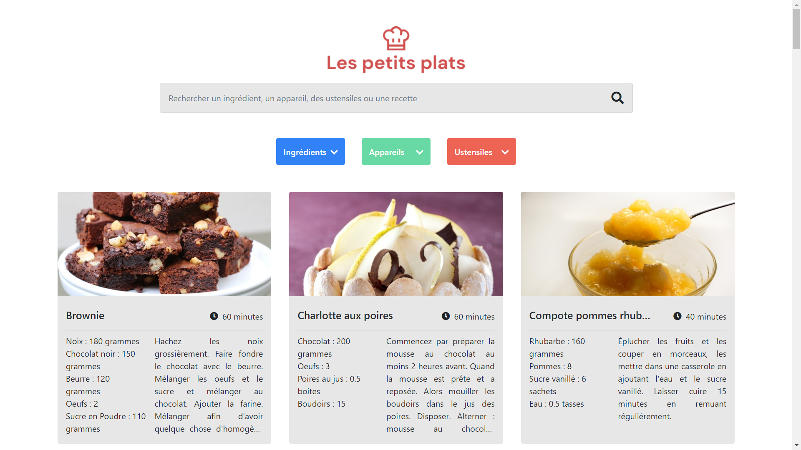

# LesPetitsPlats

    Projet fictif de formation n°05/11 | OpenClassrooms

**Home page**

<kbd></kbd>

> PROBLEMATIQUE

Afin de se démarquer des sites concurrents, les résultats d’une recherche sur le site Les Petits Plats doivent être performants en termes de rapidité et de fluidité pour retenir un maximum d’utilisateurs

> BESOIN

Recherche de recettes de cuisine avec options multiples :

- par nom
- par ingrédients
- par appareils
- par ustensiles

## Livrables

> Algorithmes de recherche

- fiche d’investigation de fonctionnalité
- 2 versions d'algorithme
- tests de performance pour les 2 versions
- recommandation de l'algorithme à conserver

> Web design

- page d'accueil du site

## Compétences développées

- [x] Analyser un problème informatique
- [x] Développer un algorithme pour résoudre un problème

## Ressources fournies

- [base de données Json](https://github.com/OpenClassrooms-Student-Center/P11-front-end-search-engine/blob/master/recipes.js)
- [maquette des pages web](https://www.figma.com/file/xqeE1ZKlHUWi2Efo8r73NK/UI-Design-Les-Petits-Plats-FR?node-id=0%3A1)
- [cas d'utilisation](https://s3-eu-west-1.amazonaws.com/course.oc-static.com/projects/Front-End+V2/P6+Algorithms/Cas+d%E2%80%99utilisation+%2303+Filtrer+les+recettes+dans+l%E2%80%99interface+utilisateur.pdf)
